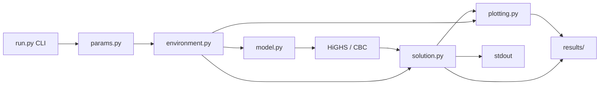

# Runtime Dataflow Map

This map shows what each file produces and where that product is consumed,
from CLI start through results.

An interactive version is also available beside the chat as the Canvas
`runtime-dataflow-map`.

## End-to-end pipeline

Run modes:

- custom solve → console summary only
- `--figure-3` → paper-model `N_l=5` PNG + JSON
- `--approximate-figure-3` → labeled `N_l=2` PNG + JSON

## 1. Parameters and environment

| Producer | Product | Goes to |
| --- | --- | --- |
| `params.py` → `ExperimentParameters` | sensors, volume, `ξ`, seed, `(|W1|,|W2|,|W3|)` | `build_environment` |
| `params.py` → `PaperParameters` / `NetworkParameters` | `Nl`, rounds, packet sizes, `Rb`, `γ`, `κ` range, `M` | environment builders; model (8)(17)(18)(21)(22); solution diagnostics |
| `params.py` → `AcousticParameters` + `PowerLevelTable` | `f0`, `ks`, `P0`, `Pr`, `Rmax(l)` | acoustic energy; network max range |
| `environment.py` → `Deployment` | `positions_m`, BS=`0`, `V`, `W` | `NetworkEnvironment`; topology plots |
| `environment.py` → `NetworkEnvironment` | `distances_m`, arcs `A`, `Rmax(lmax)` | energy; interference; model vars/(7)–(20); path reconstruction; flow plots |
| `environment.py` → `AcousticEnergyEnvironment` | `α`, `ν`, `TL(l)`, `ET(l)`, `ER`, per-arc TX energy | Constraint (21); `solution._node_energy` |
| `environment.py` → `ConnectivityPartition` | `Wn`, `kappa_by_sensor` | Constraint (18); connectivity shortfall diagnostics |
| `environment.py` → `InterferenceEnvironment` | `interfering_arcs_by_node` (`Ii_jm`) | Constraint (22); `solution._node_airtime` |
| `environment.py` → `EnvironmentData` | bundled experiment + paper + energy + connectivity + interference | `build_model`; `extract_solution`; plotting; `RunResult` |

## 2. Model and solver

| Producer | Product | Goes to |
| --- | --- | --- |
| `model.py` → `ModelVars` | `f`, `g`, `h`, `p`, `ε` (domains 23–25) | constraints; solver; extraction |
| `model.py` Objective (6) | minimize `ε` | solver; `Solution.objective_energy_j` |
| Constraints (7)–(12) | flow, generation, re-entry, coupling, single next hop | solver; reconstructed paths |
| Constraints (13)–(16), (19)–(20) | link/node disjointness, path order, phantom flow | solver; `Solution.paths` / `active_arcs` |
| Constraint (17) | control traffic `g` from `h` | solver; control-flow / energy / airtime diagnostics |
| Constraint (18) ← `kappa_by_sensor` | non-uniform `k`-connectivity | solver; active path counts |
| Constraint (21) ← link/reception energies | sensor energy ≤ `ε` | solver objective; energy residuals |
| Constraint (22) ← interfering arcs | airtime + interference ≤ available time | solver; airtime residuals |
| `model.py` → `LpProblem` | complete MILP | `run.py` `problem.solve(...)` |

## 3. Extraction, plots, and results

| Producer | Product | Goes to |
| --- | --- | --- |
| `run.py` → `solve_experiment` | `RunResult` | CLI summary; figure workflows |
| `solution.py` → `Solution` | status, termination, `ε`, gap, flows, paths, energies, airtimes, residuals | CLI; Scenario-I plot; JSON metadata |
| `plotting.py` topology PNG | Fig. 3(a)-style image | `results/figure_3a_*.png` or `approximate_figure_3a_*.png` |
| `plotting.py` scenario PNG | Fig. 3(b)-style image | `results/figure_3b_*.png` or `approximate_figure_3b_*.png` |
| `plotting.py` metadata JSON | seed, positions, `Nl`, `ε`, gap, versions, hashes | `results/*_metadata.json` |
| `run.py` stdout | Status, Termination, `ε`, gap, paths, residuals, exit code | terminal / scripts |

## Spotlight paths

### Interfering arcs

1. `build_interference_environment` → `interfering_arcs_by_node`
2. carried in `EnvironmentData.interference`
3. used by Constraint (22) in `model.py`
4. recomputed by `solution._node_airtime` for residuals

### Link energies

1. `build_acoustic_energy_environment` → per-arc TX energy + `ER`
2. used by Constraint (21)
3. recomputed by `solution._node_energy`

### Connectivity

1. explicit or seeded partition → `kappa_by_sensor`
2. used by Constraint (18)
3. checked again in solution path-count / shortfall diagnostics

## Stage boundaries

- `params.py` produces constants only — never solver objects
- `environment.py` produces coefficients only — never constraints
- `model.py` produces the MILP only — never plotting
- `solution.py` reads solver values + `EnvironmentData` — never rebuilds the graph
- `plotting.py` / `run.py` are the only writers of `results/` artifacts

As we continue the walkthrough of `model.py`, this map can be expanded with
per-constraint producer rows in more detail.
